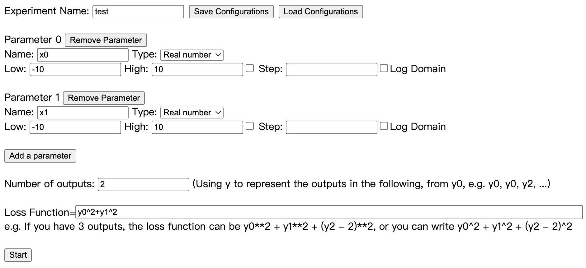
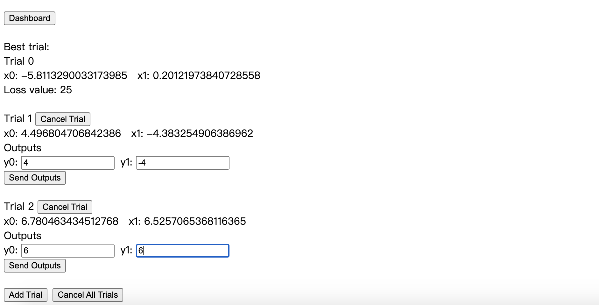
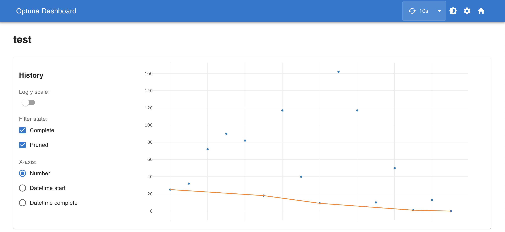
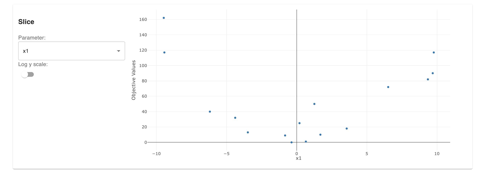
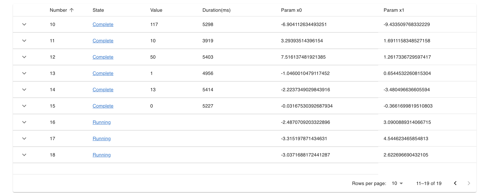

# ParamExperiment - Interactive Parameter Optimization Tool

This is a tool based on Optuna, a hyperparameter optimization tool using Bayesian Optimization strategy.

Sometimes experiment have to be done manually, it is convenient to have a tool that can help you to optimize parameters of the experiment.

## Download
Download the code here: [ParamExperiment v0.1.1](
https://github.com/timcsy/ParamExperiment/archive/refs/tags/0.1.1.zip)

Or you can use Git:
```
git clone https://github.com/timcsy/ParamExperiment.git
```

## Installation
Make sure you have Python 3

Install Python packages (Run it in the Terminal):
```
pip install -r requirements.txt
```

It's just depends on HTML, JavaScript and Python, so there's no need to install other tool except Python packages.

## Usage
Open the terminal, then switch to current folder,

Run the following command:
```
python server.py
```

Then open http://localhost:5000/ on your browser.

### The Configuration View



You can setup the type and range of parameters here, and assign the loss function, and you can also save or load the configuration.

After configuration, click the "Start" button, to enter the trial mode.

### The Trials View



The program will suggest which parameters to use, and you can add more than one trial simultaneously. Click the "Type Outputs" button to give the experiment results, and than click "Send Outputs" button to send the results. After some trials, you will get the best parameters.

It's just that simple!

You may also checkout the Dashboard to see the visualization result of the experiment.

### Dashboard - History Curve



### Dashboard - Parameter Distribution



### Dashboard - History Records



Have a nice day!

## Dependencies
- Python 3
- Flask
- nest-asyncio
- optuna
- optuna-dashboard
- websockets